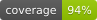

# Coverage

Auto-generated by `pnpm coverage`. Do not edit by hand. Coverage is produced locally
by `c8` (V8 coverage) and aggregated across all published packages: no third-party
coverage service is involved.

**Repo-wide line coverage: 92.64%**

| Package | Lines | Statements | Functions | Branches |
|---|---|---|---|---|
| `@did-btcr2/aggregation` | 91.9% (9040/9839) | 91.9% (9040/9839) | 87.5% (335/383) | 77.8% (1094/1407) |
| `@did-btcr2/api` | 94.0% (2117/2252) | 94.0% (2117/2252) | 98.6% (139/141) | 93.2% (272/292) |
| `@did-btcr2/bitcoin` | 88.4% (1224/1384) | 88.4% (1224/1384) | 95.8% (91/95) | 95.8% (204/213) |
| `@did-btcr2/cli` | 93.1% (4988/5359) | 93.1% (4988/5359) | 95.3% (183/192) | 85.5% (891/1042) |
| `@did-btcr2/common` | 98.4% (1078/1095) | 98.4% (1078/1095) | 96.6% (56/58) | 85.8% (217/253) |
| `@did-btcr2/cryptosuite` | 94.5% (1070/1132) | 94.5% (1070/1132) | 90.6% (29/32) | 82.8% (72/87) |
| `@did-btcr2/key-manager` | 99.3% (668/673) | 99.3% (668/673) | 100.0% (29/29) | 94.0% (63/67) |
| `@did-btcr2/keypair` | 90.5% (1135/1254) | 90.5% (1135/1254) | 80.6% (54/67) | 88.6% (109/123) |
| `@did-btcr2/method` | 90.7% (4633/5109) | 90.7% (4633/5109) | 80.9% (89/110) | 83.0% (420/506) |
| `@did-btcr2/smt` | 99.1% (1165/1176) | 99.1% (1165/1176) | 98.7% (77/78) | 94.5% (239/253) |
| **Total** | **92.6% (27118/29273)** | **92.6% (27118/29273)** | **91.3% (1082/1185)** | **84.4% (3581/4243)** |
