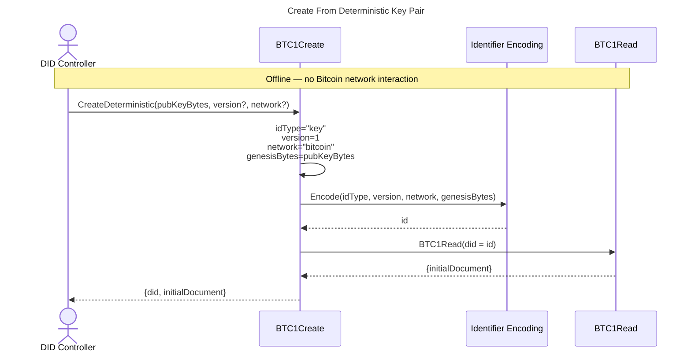
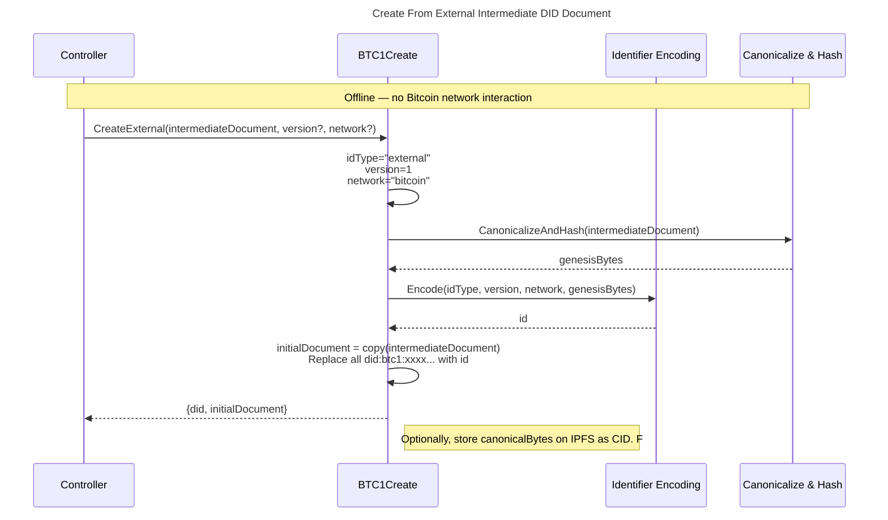
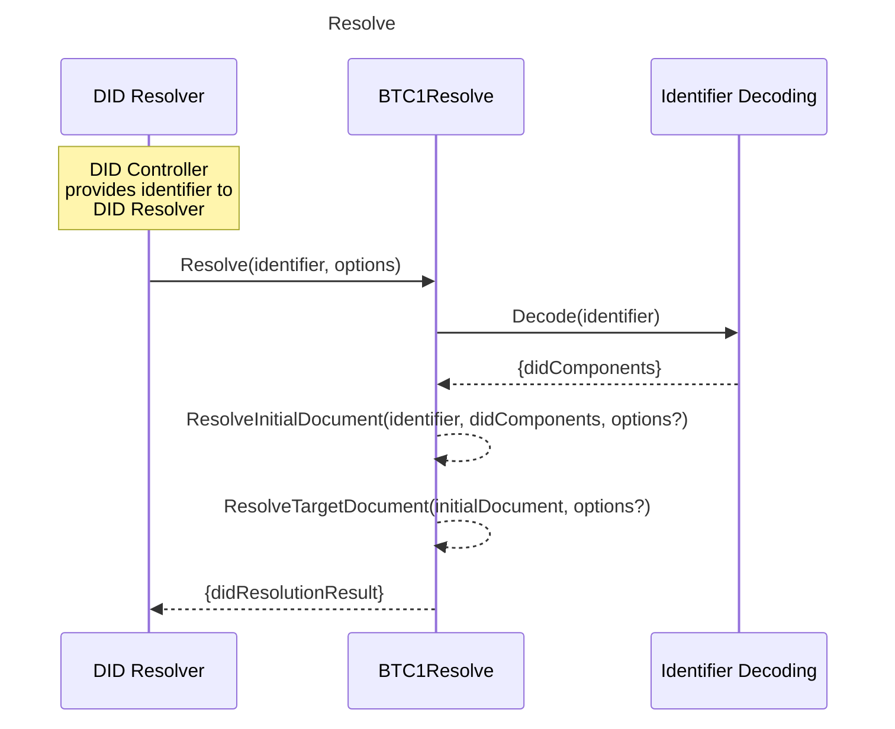
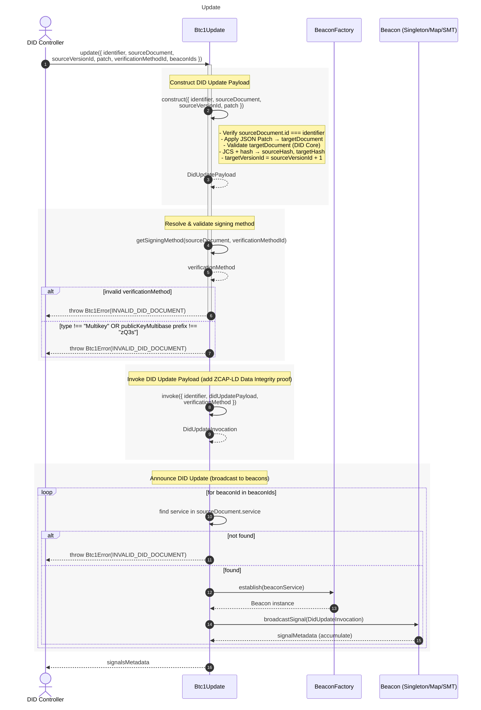

# Diagrams

## Architecture

COMING SOON

## Sequence

Below are sequence diagrams of the various data flows for the core DID Method CRUD functionality.

### Create

A did:btc1 identifier and associated DID document can either be created deterministically from a cryptographic seed, or it can be created from an arbitrary genesis intermediate DID document representation. In both cases, DID creation can be undertaken in an offline manner, i.e., the DID controller does not need to interact with the Bitcoin network to create their DID.

**Create Deterministic**

For deterministic creation, the did:btc1 encodes a secp256k1 public key into an identifier. The key is then used to deterministically generate the initial DID document.

**Create External**

For external creation, the did:btc1 encodes an arbitrary DID document into an identifier. The initial document is then used as the initial DID Document.

### Resolve

The resolve operation is executed by a resolver after a resolution request identifying a specific did:btc1 identifier is received from a client at Resolution Time. The request MAY contain a resolutionOptions object containing additional information to be used in resolution. The resolver then attempts to resolve the DID document of the identifier at a specific Target Time. The Target Time is either provided in resolutionOptions or is set to the Resolution Time of the request.

### Update

An update to a did:btc1 document is an invoked capability using the ZCAP-LD data format, signed by a verificationMethod that has the authority to make the update as specified in the previous DID document. Capability invocations for updates MUST be authorized using Data Integrity following the bip340-jcs-2025 cryptosuite with a proofPurpose of capabilityInvocation.

### Deactivate

To deactivate a did:btc1, the DID controller MUST add the property deactivated with the value true on the DID document. To do this, the DID controller constructs a valid DID Update Payload with a JSON patch that adds this property and announces the payload through a Beacon in their current DID document following the algorithm in Update. Once a did:btc1 has been deactivated this state is considered permanent and resolution MUST terminate.